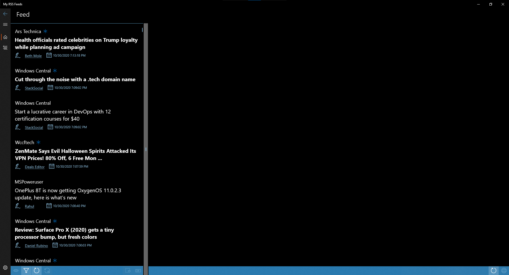
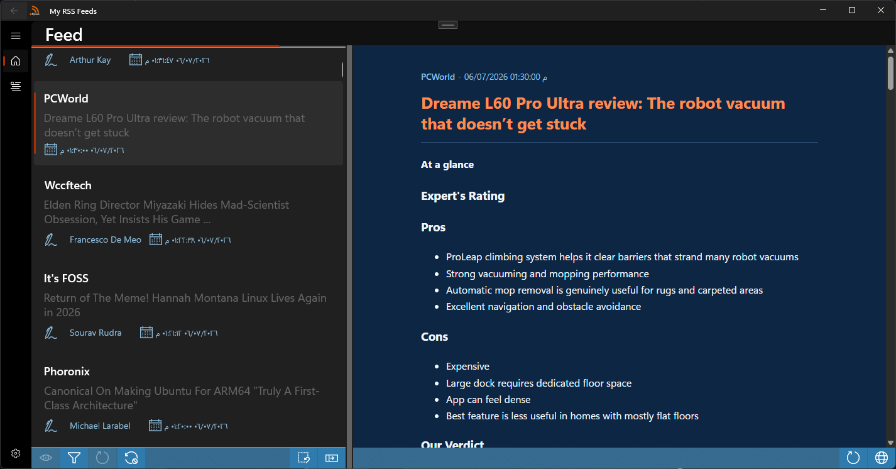
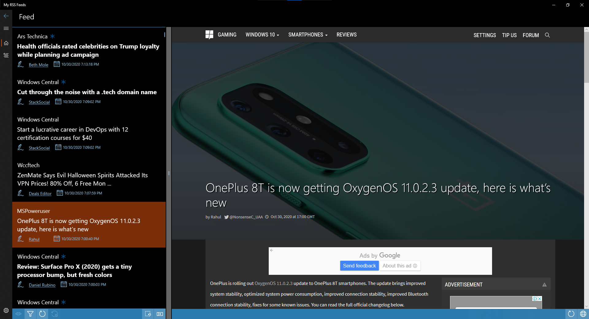
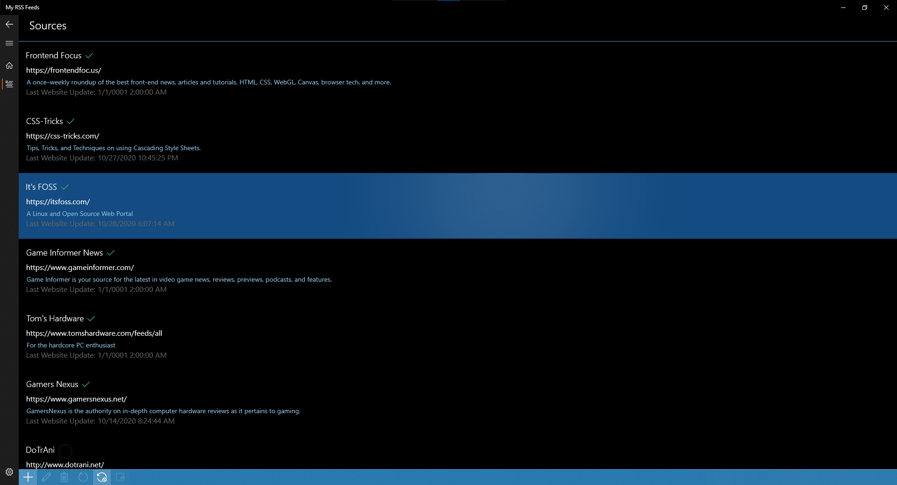
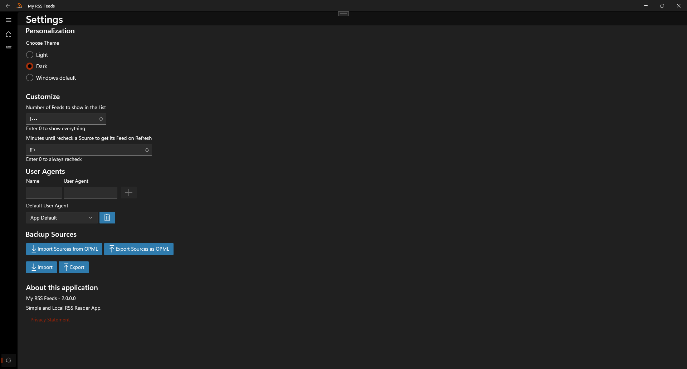
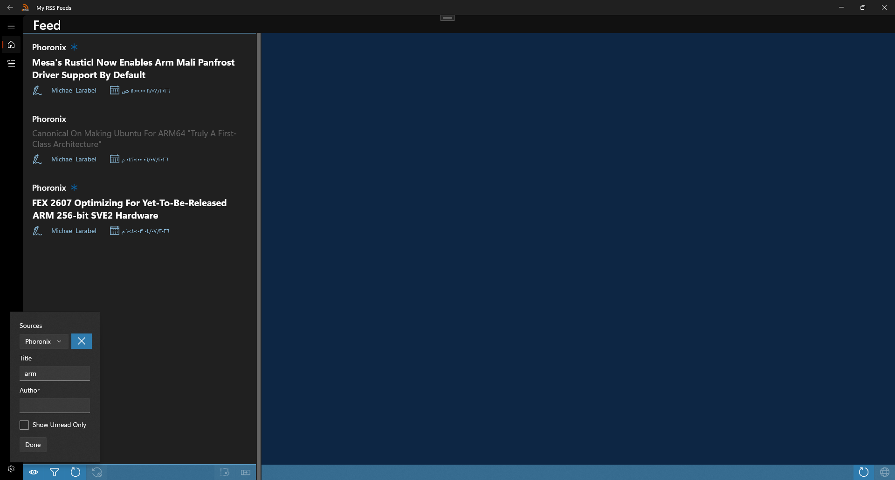
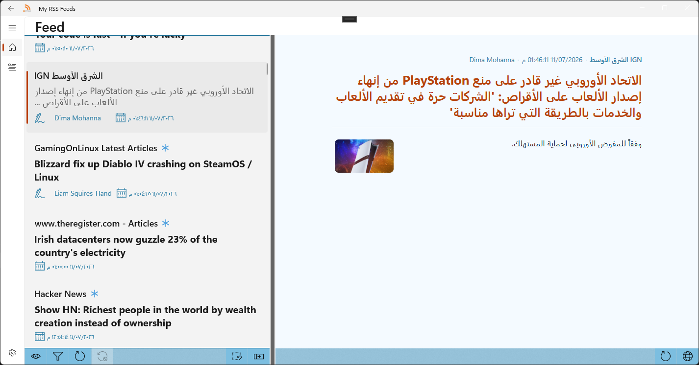
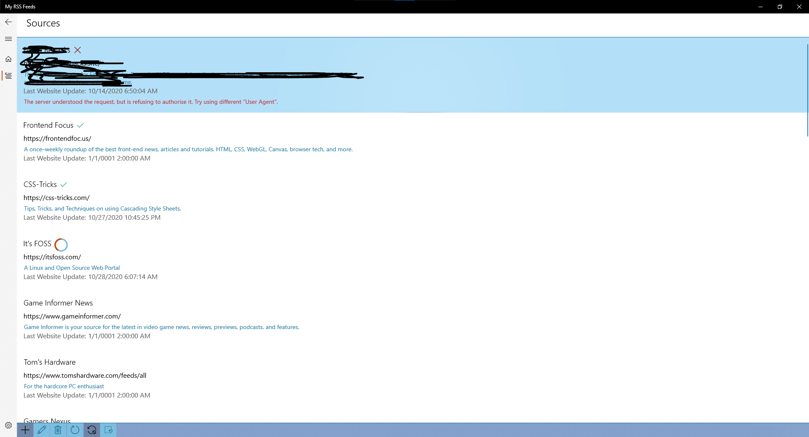

    

## My RSS Feeds
Simple, light and local WinUI 3 RSS reader that doesn't require any login or show any ads.

- Built with WinUI 3 (Windows App SDK) and .NET 10
- Runs on Windows 10 22H2 or higher (x86, x64 and ARM64)
- Supports OPML import and export
- Better support for ARM64 devices (Snapdragon Copilot+ PCs)

#### Download
You can get the app from the [Microsoft Store](https://apps.microsoft.com/detail/9N24N9195ZM1)

#### Screenshots
Dark Theme

Light Theme

