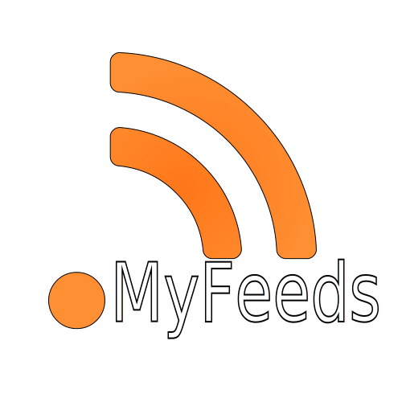

## My RSS Feeds
Simple, Light and Local UWP Rss reader that doesn't required any logins or have any ads.

The app runs on windows 10 1903 or higher

#### Download
You can get the app from Microsoft Store [website](https://www.microsoft.com/store/apps/9N24N9195ZM1) or the store Windows [app](ms-windows-store://pdp/?productid=9N24N9195ZM1)

#### Screenshots

