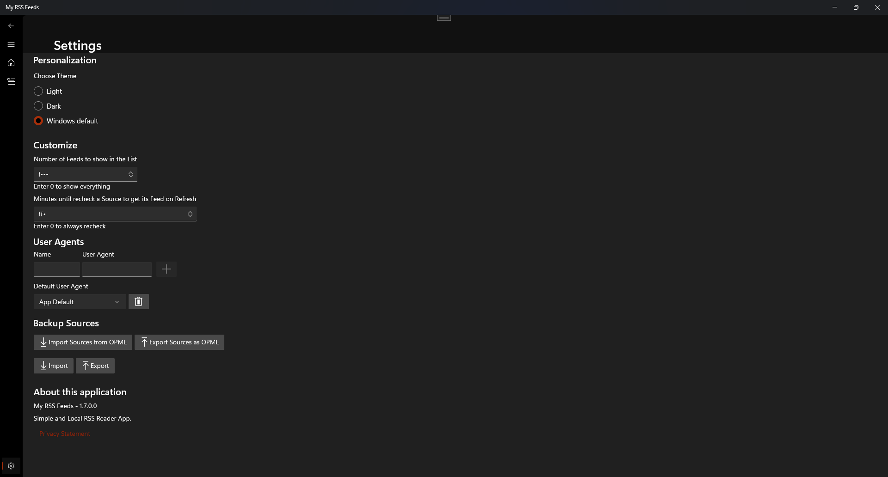
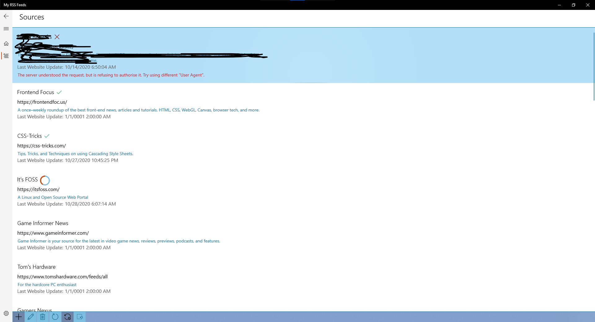

    

## My RSS Feeds
Simple, Light and Local UWP Rss reader that doesn't required any logins or have any ads.

The app runs on windows 10 22H2 (latest version) or higher

The app now support OPML

#### Download
You can get the app from Microsoft Store [website](https://www.microsoft.com/store/apps/9N24N9195ZM1) or [the app](ms-windows-store://pdp/?productid=9N24N9195ZM1)

#### Screenshots
Dark Theme

Light Theme

